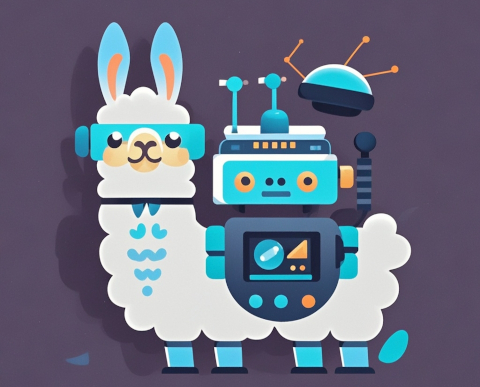
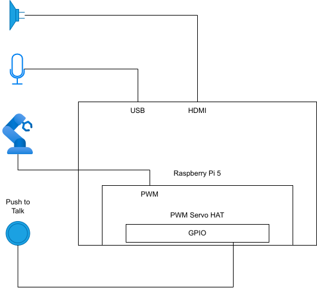

# LlamaPi Robot: Voice Chatbot with LLM and Robot Arm

<div align="center">
  
  <p>Picture generated by AI (Doubao).</p>
</div>

## Intro

An initial attempt for exploring the possibilities of **Voice + LLM + Robotics**,
this is a voice chatbot running on Raspberry Pi 5 backed by local or cloud-based LLM,
allowing the user to control **robot arm gestures** through natural voice interactions.

- Backed by local LLM (**Llama-3.2 3B**) or cloud-based LLMs (**Gemini**, Coze).
- Local ASR (`faster_whisper`) and TTS (`piper`).
- Robot arm commands generated by LLM based on the context of the conversation.
- A simple GUI (TkInter-based) showing the conversation and status of the push button.

NOTE: This project is still very preliminary and subject to major refactor/enhancements.

## Demo

To be added...

## System Setup

Hardware:
- Raspberry Pi 5, 8GB RAM
- Toy robot arm using PWM servos
- PWM servo hat for Raspberry Pi ([example](https://www.waveshare.net/wiki/Servo_Driver_HAT))
- Push button (similar to [my other project](https://github.com/zhoupingjay/llm_voice_chatbot_rpi))

Software:
- Raspbian OS (Debian 12) desktop

<p>
  
</p>

## Install

### Dependencies

Create a virtual environment.
```
mkdir ~/.virtualenvs/
python3 -m venv ~/.virtualenvs/llamapi
source ~/.virtualenvs/llamapi/bin/activate
```

Install system packages:
```
sudo apt install portaudio19-dev
sudo apt install libopenblas-dev libopenblas-pthread-dev libopenblas-openmp-dev libopenblas0 libopenblas0-pthread libopenblas0-openmp
sudo apt install libopenblas64-0 libopenblas64-dev libopenblas64-pthread-dev libopenblas64-openmp-dev
sudo apt install ccache build-essential cmake
```

Install Python modules:
```
pip install pyaudio wave soundfile
pip install faster_whisper numpy

# RPi.GPIO doesn't work, use rpi-lgpio as a drop-in replacement
pip uninstall RPi.GPIO
pip install rpi-lgpio

pip install opencc
pip install smbus

# For use with OpenBLAS:
CMAKE_ARGS="-DGGML_BLAS=ON -DGGML_BLAS_VENDOR=OpenBLAS" pip install llama-cpp-python
CMAKE_ARGS="-DGGML_BLAS=ON -DGGML_BLAS_VENDOR=OpenBLAS" pip install 'llama-cpp-python[server]'
pip install openai
```

Checkout the LlamaPi code:
```
git clone https://github.com/zhoupingjay/LlamaPi.git
```

### Setup the LLM

[NEW] Language model ([Llama-3.2 3B Instruct](https://huggingface.co/meta-llama/Llama-3.2-3B-Instruct)):
- Download the model. A good tool is the [download script](https://github.com/pytorch-labs/gpt-fast/blob/main/scripts/download.py)
  from [gpt-fast](https://github.com/pytorch-labs/gpt-fast).
- Quantize the model to 8-bit or 5-bit so it can fit in the 8GB RAM on Raspberry Pi.
- You may use the quantization tool from [llama.cpp](https://github.com/ggerganov/llama.cpp),
  or use the [GGUF-my-repo](https://huggingface.co/spaces/ggml-org/gguf-my-repo) space on Hugging Face.
- Create a `llm` folder under `LlamaPi`, and download the quantized model (`.gguf` file) under this folder.

Language model ([Llama-3.1 8B Instruct](https://huggingface.co/meta-llama/Meta-Llama-3.1-8B-Instruct)):
- Quantize the model to 4-bit so it can fit in the 8GB RAM on Raspberry Pi.
  You may use the quantization tool from [llama.cpp](https://github.com/ggerganov/llama.cpp),
  or use the [GGUF-my-repo](https://huggingface.co/spaces/ggml-org/gguf-my-repo) space on Hugging Face.
- Create a `llm` folder under `LlamaPi`, and download the 4-bit quantized model (`.gguf` file) under this folder.
  E.g. `llm/meta-llama-3.1-8b-instruct-q4_k_m.gguf`.

### ASR

- Use [faster_whisper](https://github.com/SYSTRAN/faster-whisper) installed from pip.
  It will download the ASR model to local on the first run.

### TTS

- Use [piper](https://github.com/rhasspy/piper) for TTS.
- Create a `tts` folder under `LlamaPi`, download and extract piper in this folder.
```
cd tts
wget https://github.com/rhasspy/piper/releases/download/v1.2.0/piper_arm64.tar.gz
tar zxf piper_arm64.tar.gz
```
- Download voice file: https://github.com/rhasspy/piper/blob/master/VOICES.md
  You need the `.onnx` file and `.json` file for each voice.
  For example: `en_US-amy-medium.onnx` and `en_US-amy-medium.onnx.json`.
  Create a `voices` folder under `LlamaPi/tts`, and put voice files under this folder.

The directory structure should look like this:
```
LlamaPi
├── llm
|   └── (model .gguf file)
└── tts
    ├── piper
    |   └── (piper binaries)
    └── voices
        └── (voice files)
```

## Robot Arm

To be added

## Usage

In your virtual environment, run the `LlamaPi_local.py` script:
```
python LlamaPi_local.py
```

You'll see a window with big blue button and a text box showing the conversation.

The robot uses a "push-to-talk" mode for interaction:
Hold the button, talk, and release the button after you finish.
The robot will respond with text and voice.

The robot will also generate simple robot arm commands based on
the context of your conversation:
- If you say hello to the robot, it will generate a `$greet` command;
- If you sounds happy, it will generate a `$smile` command;
- If you sounds negative, it will generate a `$pat` command.
- If you ask it to hand over or retrieve something, it will generate a `$retrieve` command to mimic the "retrieve" action.

These simple commands will result in different gestures from the robot arm.

## Challenges and Future Works

The biggest challenge is the performance of running LLM on a low-power edge device like Raspberry Pi.
With 4-bit quantization, I was able to fit Llama-3.1 8B on the device, but the generation speed was about 1.8 tokens/second (using llama.cpp + OpenBLAS).

Llama-3.2 3B model is a bit faster (~3.3 tokens/second with 5-bit quantization), so this is the default choice now.

Some of the future works in my mind:

- Improve inference speed by leveraging the VideoCore GPU on Raspberry Pi 5.
- Try LLMs that are more efficient in inference (e.g. RWKV).
- Try more sophisticated prompts.
- Improve the UI.
- ...

## Related Project

[LLM Voice Chatbot](https://github.com/zhoupingjay/llm_voice_chatbot_rpi)
